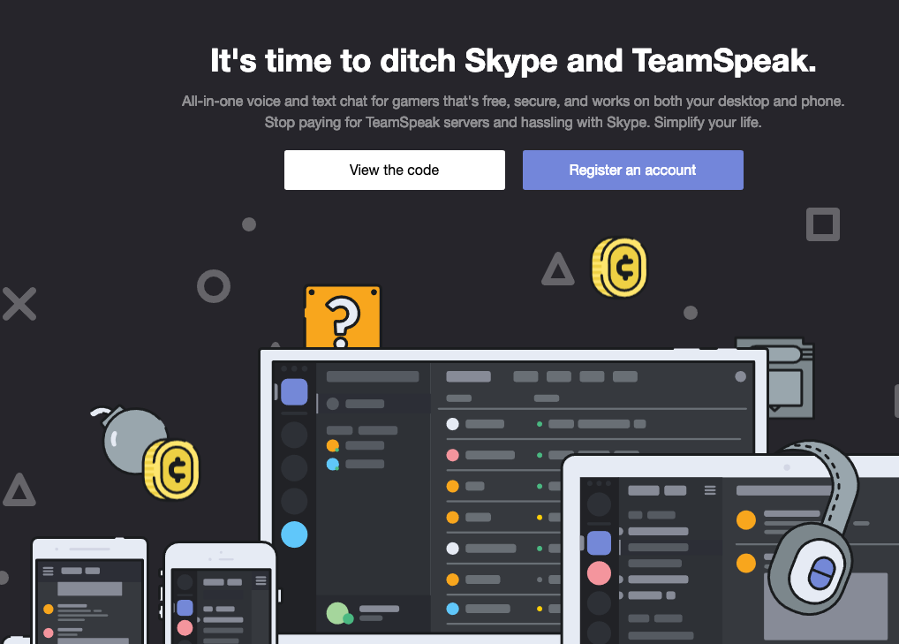
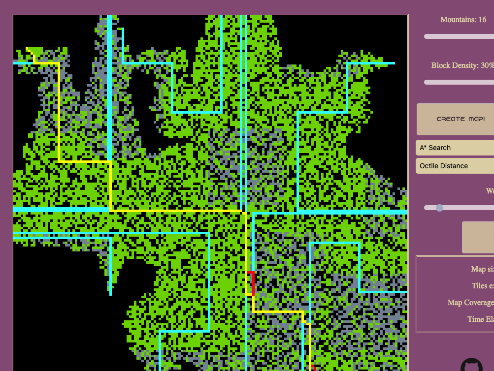
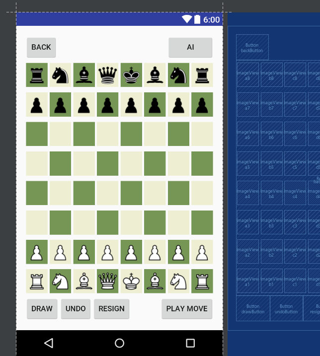

<!-- Sidebar -->
<section id="sidebar">
	

		<nav>
			<ul>
				<li><a href="#intro">Welcome</a></li>
				<li><a href="#one">About me</a></li>
				<li><a href="#two">Portfolio</a></li>
				<li><a href="#three">Contact</a></li>
			</ul>
		</nav>
	

</section>

<!-- Wrapper -->

<!-- Intro -->
<section id="intro" class="wrapper style1 fullscreen fade-up">
	

		<h1 class="major">Hey there.</h1>
		
My name is Andrew Wang. 
		I'm a software engineer based in New York City.

		<ul class="actions">
			<li><a href="#one" class="button scrolly icon primary fa-arrow-down">About me</a></li>
		</ul>
	

</section>

<!-- One -->
<section id="one" class="wrapper style2 fade-up">
	

		<h2 class="major">About me</h2>
		

			
				
			
			I'm a full stack developer with experience in web application development using Ruby on Rails, React, Redux, and SQL.    
			I've worked with a variety of technologies through hobby projects and undergraduate courses at Rutgers University, where I studied Mathematics, Computer Science, and Music.   
			Outside of software development, I've been a fencer, coach, and former competitive esport player and coach.
		

		<section>
		

			

				<ul class="icons-large menu">
					<li><i class="devicon-ruby-plain"></i><a class="icon"> Ruby</a></li>
					<li><i class="devicon-python-plain"></i><a class="icon"> Python</a></li>
					<li><i class="devicon-java-plain"></i><a class="icon"> Java</a></li>
					<li><i class="devicon-javascript-plain"></i><a class="icon"> Javascript</a></li>
				</ul>
			

		

		

			

				<ul class="icons-large menu">
					<li><i class="devicon-rails-plain"></i><a class="icon"> Rails</a></li>
					<li><i class="devicon-nodejs-plain"></i><a class="icon"> NodeJS</a></li>
					<li><i class="devicon-react-plain"></i><a class="icon"> React</a></li>
					<li><i class="devicon-express-original"></i><a class="icon"> Express</a></li>
					<li><i class="devicon-jquery-plain"></i><a class="icon"> jQuery</a></li>
				</ul>
			

		

		

			

				<ul class="icons-large menu">
					<li><i class="devicon-postgresql-plain"></i><a class="icon"> PostgreSQL</a></li>
					<li><i class="devicon-mongodb-plain"></i><a class="icon"> MongoDB</a></li>
					<li><i class="devicon-mysql-plain"></i><a class="icon"> MySql</a></li>
					<li><i class="devicon-git-plain"></i><a class="icon"> Git</a></li>
					<li><i class="devicon-heroku-original"></i><a class="icon"> Heroku</a></li>
				</ul>
			

		

		<ul class="actions">
			<li><a href="/resume.pdf" class="button icon fa-copy">Resume</a></li>
			<li><a href="{{ site.github_url }}" class="button primary icon fa-github">Github</a></li>
			<li><a href="#two" class="button primary icon scrolly fa-arrow-down">Portfolio</a></li>
		</ul>
		</section>
	

</section>

<!-- Two -->
<section id="two" class="wrapper style3 spotlights">
	<section>
		
		

			

				<h2>Harmony</h2>
				
Full stack clone of Discord, a popular voice and text chat application. Implemented with
				Ruby on Rails, React, Redux, SQL.

				<ul class="actions">
					<li><a href="{{ site.harmony_url }}" class="button">View online</a></li>
					<li><a href="{{ site.harmony_gh }}" class="button primary icon fa-github">Github</a></li>
				</ul>
				<ul class="icons-xl menu">
					<li><i class="devicon-ruby-plain"></i></li>
					<li><i class="devicon-javascript-plain"></i></li>
					<li><i class="devicon-rails-plain"></i></li>
					<li><i class="devicon-react-plain"></i></li>
					<li><i class="devicon-postgresql-plain"></i></li>
				</ul>
				<ul class="icons-xl menu">
					<li><i class="devicon-webpack-plain"></i></li>
					<li><i class="devicon-heroku-original"></i></li>
					<li><i class="devicon-html5-plain-wordmark"></i></li>
					<li><i class="devicon-css3-plain-wordmark"></i></li>
				</ul>
			

		

	</section>
	<section>
		
		

			

				<h2>A* Pathfinder</h2>
				
JS implementation of A* search algorithms for discretized grid environments.

				<ul class="actions">
					<li><a href="{{ site.astar_url }}" class="button">View online</a></li>
					<li><a href="{{ site.astar_gh }}" class="button primary icon fa-github">Github</a></li>
				</ul>
				<ul class="icons-xl menu">
					<li><i class="devicon-javascript-plain"></i></li>
					<li><i class="devicon-webpack-plain"></i></li>
					<li><i class="devicon-html5-plain-wordmark"></i></li>
					<li><i class="devicon-css3-plain-wordmark"></i></li>
				</ul>
			

		

	</section>
	<section>
		
		

			

				<h2>Twitmern</h2>
				
MERN Stack Twitter clone. 

				<ul class="actions">
					<!-- <li><a href="{{ site.twitmern_url }}" class="button">Learn more</a></li> -->
					<li><a href="{{ site.twitmern_gh }}" class="button primary icon fa-github">Github</a></li>
				</ul>
				<ul class="icons-xl menu">
					<li><i class="devicon-javascript-plain"></i></li>
					<li><i class="devicon-mongodb-plain"></i></li>
					<li><i class="devicon-express-original"></i></li>
					<li><i class="devicon-react-plain"></i></li>
					<li><i class="devicon-nodejs-plain"></i></li>
				</ul>
				<ul class="icons-xl menu">
					<li><i class="devicon-heroku-original"></i></li>
					<li><i class="devicon-html5-plain-wordmark"></i></li>
					<li><i class="devicon-css3-plain-wordmark"></i></li>
				</ul>
			

		

	</section>
	<section>
		
		

			

				<h2>Android Chess</h2>
				
Android Chess app written in Java, featuring data serialization for history storage and playback.

				<ul class="actions">
					<li><a href="{{ site.chess_gh }}" class="button primary icon fa-github">Github</a></li>
				</ul>
				<ul class="icons-xl menu">
					<li><i class="devicon-java-plain"></i></li>
					<li><i class="devicon-android-plain"></i></li>
					<li><i class="devicon-gradle-plain"></i></li>
				</ul>
			

		

	</section>
	<section>
		
		

			

				<h2>10bot</h2>
					
Custom Discord server management bot. Implemented with Ruby, SQLite3, and a custom ORM.

				<ul class="actions">
					<li><a href="{{ site.tenbot_gh }}" class="button primary icon fa-github">Github</a></li>
				</ul>
				<ul class="icons-xl menu">
					<li><i class="devicon-ruby-plain"></i></li>
					<!-- <li><i class="icon primary fa-discord"></i></li> -->
					<li><i class="icon primary fa-database"></i></li>
				</ul>
			

		

	</section>
	<section>
		
		

			

				<h2>Song Library</h2>
					
Simple JavaFX GUI song library application.

				<ul class="actions">
					<li><a href="{{ site.song_gh }}" class="button primary icon fa-github">Github</a></li>
				</ul>
				<ul class="icons-xl menu">
					<li><i class="devicon-java-plain"></i></li>
				</ul>
			

		

	</section>
</section>

<!-- Three -->
<section id="three" class="wrapper style1 fade-up">
	

		<h2 class="major">Contact</h2>
		
Let's get in touch.

		

			<section>
				<form method="post" action="https://formspree.io/{{ site.email }}">
					

						<label for="name">Name</label>
						<input type="text" name="name" id="name" />
					

					

						<label for="email">Email</label>
						<input type="text" name="_replyto" id="email" />
					

					

						<label for="message">Message</label>
						<textarea name="message" id="message" rows="5"></textarea>
					

					<ul class="actions">
						<li><input type="submit" class="button submit icon primary fa-envelope" value="Send Message"/></li>
						<li><a href="#intro" class="button scrolly icon primary fa-arrow-up">Back up</a></li>
					</ul>
				</form>
			</section>
			<section>
				<ul class="contact">
					<li>
						<h3>Location</h3>
						New York City, NY USA
					</li>
					<li>
						<h3>Email</h3>
						<a href="mailto:{{ site.email }}">contact@andrewyw.io</a>
					</li>
					<li>
						<h3>Social</h3>
						<ul class="icons">
							<li><a href="https://www.github.com/AndrewYW" class="fa-github">GitHub</a></li>
							<li><a href="https://www.linkedin.com/in/andrewyw" class="fa-linkedin">LinkedIn</a></li>
							<li><a href="https://angel.co/andrewyw" class="fa-angellist">AngelList</a></li>
						</ul>
					</li>
				</ul>
			</section>
		

	

</section>

